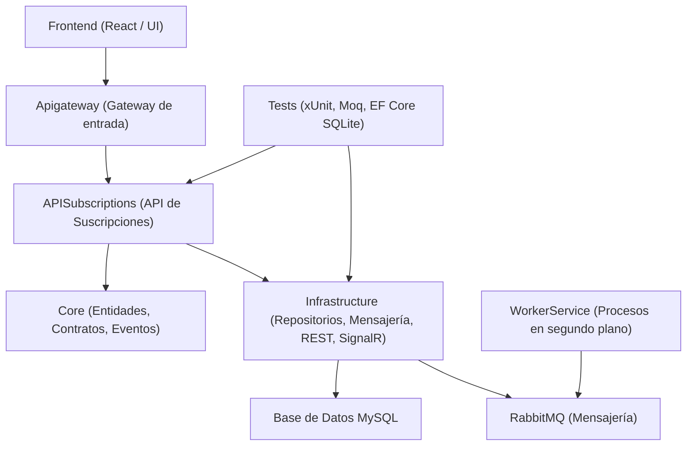
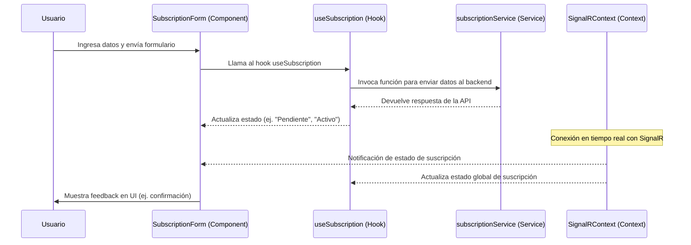

# EmpresaProyecto


---
## 🏛️ Arquitectura

La solución sigue una arquitectura por capas inspirada en principios de **Clean Architecture / DDD (Domain-Driven Design)**.  
Cada proyecto tiene una responsabilidad clara y separada:

- **Core (Dominio):** Entidades, contratos y modelos que representan la lógica de negocio.  
- **Infrastructure (Infraestructura):** Persistencia, mensajería, comunicación y acceso a servicios externos.  
- **APISubscriptions (Aplicación):** Expone la lógica de negocio mediante controladores y servicios, actuando como API principal.  
- **Apigateway:** Punto de entrada unificado para enrutar peticiones hacia las distintas APIs.  
- **WorkerService:** Procesos en segundo plano para tareas asíncronas (ej. mensajería, notificaciones).  
- **Frontend:** Interfaz de usuario (React) que consume las APIs.  
- **Tests:** Proyecto de pruebas unitarias e integración para validar la solución.  

---

## 📂 Estructura de proyectos

<details>
<summary>Apigateway</summary>

- Actúa como puerta de entrada a la solución.  
- Centraliza el enrutamiento hacia las APIs internas.  

</details>

<details>
<summary>EmpresaProyecto.APISubscriptions</summary>

- API dedicada a la gestión de suscripciones y clientes.  
- Contiene:  
  - **Controllers:** `SubscriptionController.cs`  
  - **DTO:** `SubscriptionDTO.cs`  
  - **Helpers:** `Mappers.cs`  
  - **Services:**  
    - Contracts: `ISubscriptionService.cs`  
    - Implementations: `SubscriptionService.cs`  

</details>

<details>
<summary>EmpresaProyecto.Core</summary>

- Núcleo del dominio.  
- Contiene:  
  - **Entities:** `Cliente.cs`, `Suscripcion.cs`  
  - **Enums:** `SubscriptionStateEnum.cs`  
  - **Messaging:**  
    - Contracts: `IEventConsumer.cs`, `IEventPublisher.cs`  
    - Events: `SubscriptionRequestedEvent.cs`  
  - **Models:** `RabbitSettings.cs`  
  - **Repository.Contracts:** `IClientRepository.cs`, `ISubscriptionRepository.cs`  
  - **Rest.Contracts:** `IPaymentGateway.cs`  

</details>

<details>
<summary>EmpresaProyecto.Infrastructure</summary>

- Implementación de la capa de infraestructura.  
- Contiene:  
  - **Communication:** `NotificationHub.cs`  
  - **Messaging:** `RabbitConsumer.cs`, `RabbitPublisher.cs`  
  - **Persistence.Context:** `SubscriptionContext.cs`, `TransactionService.cs`  
  - **Persistence.Repository.Implementations:** `ClientRepository.cs`, `SubscriptionRepository.cs`  
  - **Rest:** `PaymentGatewayClient.cs`  

</details>

<details>
<summary>EmpresaProyecto.WorkerService</summary>

- Servicio en segundo plano.  
- Contiene:  
  - **Services.Contracts:** `ISubscriptionService.cs`  
  - **Services.Implementations:** `SubscriptionService.cs`  

</details>

<details>
<summary>EmpresaProyecto.Tests</summary>

- Proyecto de pruebas unitarias e integración.  
- Usa **xUnit + Moq + EF Core SQLite InMemory**.  
- Incluye pruebas de integración con `WebApplicationFactory`.  

</details>

<details>
<summary>Frontend</summary>

- Aplicación web (React).  
- Consume las APIs expuestas por **Apigateway**.  
- Implementa formularios de suscripción, notificaciones en tiempo real y gestión de clientes.  

</details>

---
## 🖼️ Diagrama de Arquitectura

---
## 📌 Casos de Uso
1. Crear Suscripción
```mermaid
sequenceDiagram
    participant User as Usuario (Frontend)
    participant AG as API Gateway
    participant API as APISubscriptions
    participant DB as Base de Datos (MySQL)
    participant MQ as RabbitMQ/Kafka
    participant WS as Worker Service
    participant External as Webhook Externo

    User->>AG: POST /api/subscription (Datos + Pago)
    AG->>API: Redirige petición
    API->>DB: Insertar Suscripción (Estado: PENDING)
    API->>MQ: Publicar evento "SubscriptionRequestedEvent"
    API-->>User: 202 Accepted (Esperando notificación)

    MQ->>WS: WorkerService recibe evento
    WS->>WS: Procesar Pago Simulado

    alt Pago Exitoso
        WS->>DB: Actualizar Suscripción a ACTIVE
        WS->>External: POST Webhook (Notificación)
        alt Webhook Falla
            WS->>WS: Reintentar (Exponential Backoff)
        end
        WS-->>User: Notificación WebSocket (Éxito)
    else Pago Fallido
        WS->>DB: Actualizar Suscripción a REJECTED
        WS-->>User: Notificación WebSocket (Error)
    end
   ```
---

## 🚀 Flujo general
- El Frontend envía solicitudes al Apigateway.
- El Apigateway enruta hacia APISubscriptions.
- La API usa Core (contratos, entidades) y Infrastructure (repositorios, mensajería, REST).
- Infrastructure conecta con RabbitMQ y la base de datos MySQL.
- WorkerService procesa eventos en segundo plano.
- Tests aseguran calidad y cobertura de la solución.

---
## 🐳 Ejecución con Docker

El proyecto puede iniciarse fácilmente usando **Docker Compose** y los comandos definidos en el `Makefile`.

### 🔹 Pasos básicos

1. **Levantar la aplicación**
   ```bash
   make up
   ```
    - Inicia todos los contenedores definidos en docker-compose.yml.
    - Usa la opción --wait para asegurarse de que los servicios estén listos antes de continuar.


2. **Detener la aplicación**
   ```bash
   make down
   ```
      - Apaga y elimina los contenedores.

🔹 Comandos útiles
- Conectar a la base de datos MySQL
    ```bash
       make connect-db
    ```
    - Abre una sesión interactiva en el contenedor de MySQL con el usuario devuser.

## 📌 Notas importantes:
- Asegúrate de estar en el directorio raíz del proyecto para los comandos make: ..\EmpresaProyecto
- Necesitas tener Docker Desktop instalado en tu máquina.
- Los contenedores incluyen servicios de MySQL y RabbitMQ para pruebas locales.

---

## 💻 Ejecución Local (sin Docker)
Si prefieres correr la aplicación directamente en tu entorno de desarrollo y los comandos definidos en el `Makefile`.

## 🔹 Backend (.NET)
1. Restaurar dependencias:
```bash
dotnet restore EmpresaProyecto.slnx
```
2. Compilar:
```bash
dotnet build EmpresaProyecto.slnx
```
3. Ejecutar Apigateway:
```bash
dotnet run --project Apigateway
```
4. Ejecutar API de Suscripciones:
```bash
dotnet run --project EmpresaProyecto.APISubscriptions
```
5. Ejecutar WorkerService:
```bash
dotnet run --project EmpresaProyecto.WorkerService
```

6. Ejecutar BD, RabbitMQ y Servicio externo pago(ficticio):
    - Usar Docker para levantar solo estos servicios.
    1. Levantar servicios necesarios:
    ```bash
    make up-local
    ```
    2. Detener servicios:
    ```bash
    make down
    ```
    📌Asegúrate de estar en el directorio raíz del proyecto para los comandos make: ..\EmpresaProyecto


## 📌 Notas:
 Para ejecución local necesitas tener instalados:
- .NET 8 SDK
- Docker Desktop (para servicios de MySQL y RabbitMQ)
- Node.js 18+
- npm aparte.

---
---

## 🚀 Frontend (React)

 🔹 Funcionalidades principales
- Formulario de suscripción: captura datos del usuario y los envía al backend.
- SignalR context: recibe notificaciones en tiempo real sobre el estado de la suscripción.
- Custom hooks: encapsulan lógica de negocio y estado (useSubscription).
- Servicios: centralizan llamadas HTTP al backend (subscriptionService).
- Pruebas: unitarias y E2E para garantizar calidad y confiabilidad

```richdisplay
Frontend/
├── node_modules/              # 📦 Dependencias instaladas con npm/yarn
├── public/                    # 🌐 Archivos estáticos (index.html, favicon, etc.)
├── src/                       # 💻 Código fuente principal
│   ├── components/            # 🎨 Componentes reutilizables de UI
│   │   ├── SubscriptionForm.css   # Estilos del formulario de suscripción
│   │   └── SubscriptionForm.tsx   # Formulario de suscripción (React + TS)
│   ├── contexts/              # 🌍 Contextos globales (React Context API)
│   │   └── SignalRcontext.tsx     # Contexto para manejar conexión SignalR
│   ├── hooks/                 # 🔄 Custom hooks para lógica reutilizable
│   │   └── useSubscription.tsx    # Hook para manejar estado de suscripción
│   ├── services/              # 🔌 Servicios para comunicación con APIs
│   │   └── subscriptionService.tsx # Funciones para consumir la API de suscripciones
├── test-results/              # 🧪 Resultados de pruebas automatizadas
└── test/                      # ✅ Archivos de pruebas (unitarias/E2E)
```

## 🔹 Explicación del flujo
- Components
    - SubscriptionForm.tsx + SubscriptionForm.css: UI del formulario de suscripción.
    - Se conecta con el hook useSubscription para manejar estado y lógica.
- Hooks
    - useSubscription.tsx: encapsula la lógica de suscripción (ej. enviar datos, manejar estados).
    - Llama a subscriptionService para interactuar con la API.
- Services
    - subscriptionService.tsx: funciones que hacen llamadas HTTP al backend.
    - Es la capa que conecta frontend con API Gateway.
- Contexts
    - SignalRcontext.tsx: mantiene la conexión en tiempo real con el backend vía SignalR.
    - Permite que componentes como SubscriptionForm reciban notificaciones de estado.

---
## 🧪 Testing
- Unit tests: en la carpeta test/.
- Resultados: se guardan en test-results/.
- E2E tests: configurados con Playwright para validar flujos completos
---
## ⚙️ Instalación y ejecución local (sin Docker)

1. Instalar dependencias:
```bash
cd Frontend
npm install
```
2. Ejecutar aplicación:
```bash
npm start
```
## 🐳 Ejecución con Docker
1. Seguir pasos de backend en la parte superior de este readme. 
2. Abrir url http://localhost:3000/
 
